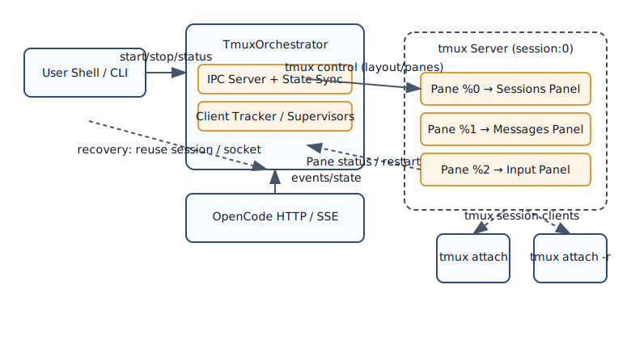

# TmuxCoder Architecture Deep Dive: Why Tmux?

## 1. Core Design Problem

### 1.1 The Challenge of AI Coding Sessions
AI coding sessions are fundamentally different from standard terminal interactions:
- **Long-running**: Sessions can last hours or days.
- **Stateful**: Context (chat history, code snippets, user intent) must be preserved.
- **Asynchronous**: AI responses stream in over time; the user shouldn't be blocked.
- **Resilient**: If the UI crashes or the connection drops, the "brain" (context) must not be lost.

### 1.2 Limitations of Traditional TUI Apps
A standard Bubble Tea or ncurses application runs as a single process. If you close the terminal window, the process dies. If the process crashes, the state is lost. To achieve persistence, you typically need a client-server architecture where the server runs as a daemon.

### 1.3 The Three Key Requirements
1.  **Persistence**: Work must survive window closures and network disconnects.
2.  **Multitasking**: Users need to see chat, code, and input simultaneously in a tiled layout.
3.  **Separation of Concerns**: The UI should be decoupled from the logic that manages the AI interaction.

## 2. The Role of tmux

TmuxCoder chooses **tmux** not just as a UI library, but as the **architectural cornerstone**.

### 2.1 More Than a UI Framework
In TmuxCoder, tmux acts as:
- **The Process Container**: It hosts the panel processes.
- **The Session Manager**: It handles the lifecycle of the workspace.
- **The Persistence Layer**: It keeps processes running even when no client is attached.
- **The Window Manager**: It handles splitting, resizing, and layout management natively.

### 2.2 Key Architectural Components

1.  **The Orchestrator (Daemon)**
    - Runs in the background (detached).
    - Manages the global state (sessions list, message history).
    - Exposes an IPC socket for panels to communicate.
    - Supervises the tmux session.

2.  **The Tmux Session**
    - A persistent container created by the orchestrator.
    - Holds the layout of panes.
    - Survives terminal detach.

3.  **The Panels (UI Clients)**
    - Independent Bubble Tea applications running in tmux panes.
    - `opencode-sessions`: Session browser.
    - `opencode-messages`: Message history viewer.
    - `opencode-input`: User input handler.
    - They are stateless "dumb terminals" that render state from the orchestrator.

### 2.3 Process Topology



## 3. Design Decisions Analysis

### 3.1 Why not a single-process TUI?
| Feature | Single Process TUI | TmuxCoder (Multi-Process) |
| :--- | :--- | :--- |
| **Persistence** | Hard (needs custom daemon) | **Native** (tmux handles it) |
| **Layouts** | Manual (coding split views is complex) | **Native** (tmux splits) |
| **Crash Scope** | Entire app crashes | **Isolated** (one panel crashes, others stay) |
| **Native Term** | Emulated terminal inside app | **Real** terminal panes |

### 3.2 Why independent panel processes?
Each panel (`sessions`, `messages`, `input`) is a separate binary.
- **Fault Isolation**: If the message renderer panics on malformed Markdown, the input panel remains responsive. You can still save your work or restart the crashed panel.
- **Granular Supervision**: The orchestrator monitors each panel via tmux. If a panel dies, it can be restarted individually.
- **Health Checks**: Panels send heartbeats. If a panel freezes, it can be detected and killed.

### 3.3 Why IPC instead of Shared Memory?
We use Unix Domain Sockets with a custom framed protocol.
- **Simplicity**: Go's `net` package makes socket programming easy.
- **Event-Driven**: Sockets allow for easy implementation of a pub/sub model for state updates.
- **Safety**: Avoids the complexity and race conditions of shared memory concurrency.

## 4. Key Implementation Mechanisms

### 4.1 Daemon Detach
To ensure the orchestrator survives the parent shell closing, we use `setsid`.
```go
// Simplified logic for daemonization
cmd := exec.Command(os.Args[0], "daemon")
cmd.SysProcAttr = &syscall.SysProcAttr{
    Setsid: true, // Create new session, detach from TTY
}
cmd.Start()
```

### 4.2 Session Recovery
When TmuxCoder starts, it checks for an existing tmux session.
- **Orphan Detection**: If the session exists but the orchestrator is dead, it kills the zombie session to start fresh (or could attach and take over in future versions).
- **Pane Mapping**: It identifies which pane corresponds to which UI component by checking the command running in it.

### 4.3 Panel Health Monitoring
The orchestrator polls tmux to check if panes are still alive.
```go
// Pseudo-code for health check
func monitor() {
    for {
        state := tmux.GetPaneState(paneID)
        if state == "dead" {
            log.Printf("Pane %s died, restarting...", paneID)
            tmux.RespawnPane(paneID, command)
        }
        time.Sleep(1 * time.Second)
    }
}
```

## 5. Benefits vs. Costs

### Advantages
- **Robustness**: Leveraging tmux's battle-tested code for terminal management.
- **Flexibility**: Users can add standard shell panes alongside AI panels (e.g., a pane for `git status` or running tests).
- **Native Feel**: It behaves exactly like the terminal tools developers already use.

### Costs
- **Dependency**: Requires tmux to be installed.
- **Complexity**: Managing multiple processes and IPC is harder than a monolith.
- **Learning Curve**: Users unfamiliar with tmux keybindings might feel lost initially.

### Why it's worth it
For a "coding assistant", the ability to have the assistant live *alongside* your shell, persist in the background, and be reshaped to fit your workflow is critical. Tmux provides this "OS-level" window management that a single binary cannot easily replicate.

## 6. Comparison with Other Approaches

| Approach | Persistence | Multi-Pane | Complexity | Best For |
| :--- | :--- | :--- | :--- | :--- |
| **Single TUI** | No (usually) | Emulated | Medium | Simple tools |
| **TmuxCoder** | **Yes** | **Native** | **High** | **Power users / DevOps** |

## Appendix: Key Files

- `cmd/opencode-tmux/main.go`: The entry point and orchestrator logic.
- `internal/ipc/server.go`: The IPC socket server implementation.
- `internal/panels/`: Directory containing the source for each UI panel.
- `internal/tmux/`: Wrapper around tmux CLI commands.
- `internal/state/store.go`: The central state store (Redux-like).
