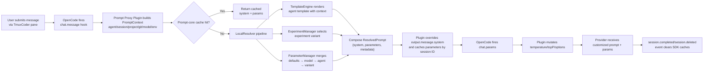

# Prompt Proxy Architecture 

## 1. Background & Constraints
- **Leave OpenCode untouched**: `packages/opencode` remains a read-only submodule so upstream updates can land without conflict.
- **Externalized prompts**: System prompts, model parameters, and experiments live in plugin-managed files that are version-controlled, reviewable, and easy to roll back.
- **Project-level isolation**: Each worktree owns its own `.opencode/` folder, which keeps template experiments scoped per project or per environment.

## 2. High-Level Topology
```
┌──────────────┐        ┌────────────────────┐        ┌──────────────────────┐
│  OpenCode    │hooks   │ Prompt Proxy Plugin│calls   │ @tmuxcoder/prompt-core│
│ (submodule)  ├──────▶ │ .opencode/plugin/  ├──────▶ │ (Local Resolver SDK)  │
└──────────────┘        └────────────────────┘        ├───────────────┬──────┘
                                                      │templates/     │parameters/
                                                      ▼               ▼
                                             .opencode/prompts/templates/*.txt
                                             .opencode/prompts/{parameters,experiments}.json
```
- OpenCode invokes `chat.message` / `chat.params` hooks; the plugin decides the final system prompt and model parameters.
- The Prompt-core SDK renders templates, applies experiments, and merges parameters; additional resolver modes (remote/hybrid) can be added without touching OpenCode.

## 3. Key Components
1. **Prompt Proxy Plugin** (`.opencode/plugin/prompt-proxy.ts`)
   - Reads `.opencode/prompts/config.json`, instantiates `TmuxCoderPrompts`, and prepares a per-session parameter cache.
   - `chat.message` enriches the context with git metadata (`git -C <worktree>`), calls the SDK, overrides `output.message.system`, and caches parameter overrides.
   - `chat.params` consumes cached parameters to set temperature/topP/model options (e.g., `options.thinking`); `event` hooks clear caches when sessions end.
2. **Prompt-core SDK** (`prompt-core/src`)
   - `TmuxCoderPrompts` manages resolver lifecycle plus an in-memory cache so multiple hooks in the same session reuse results.
   - `LocalResolver` composes:
     - `TemplateEngine`: Handlebars templates per agent (`templates/<agent>.txt`) with helpers such as `formatDate` and `uppercase`.
     - `ExperimentManager`: Loads `experiments.json`, hashes `sessionID` for sticky allocation, and layers experiment-specific parameters.
     - `ParameterManager`: Folds parameters in the order **defaults → model → agent → experiment**.
3. **Configuration assets** (`.opencode/prompts`)
   - `templates/`, `parameters.json`, and `experiments.json` are all Git-friendly, enabling change reviews and audit trails.
   - `config.json` controls resolver mode plus cache TTL/size, allowing per-project overrides.

## 4. Detailed Project Flow


## 5. Isolation & Versioning Strategy
- **Isolation**: `.opencode/prompts` is scoped to the repo/worktree, so experiments or overrides never leak across projects. CI agents can vend project-specific bundles by copying this directory.
- **Version control**: Templates and JSON configs change through regular pull requests, ensuring prompt adjustments are reviewed, traceable, and easy to revert.
- **Experimentation**: `experiments.json` supports multi-variant traffic splits. Session-ID hashing keeps allocations sticky, enabling gradual rollouts and instant rollback by flipping the config.

## 6. Extension Opportunities
- **Remote mode**: `PromptConfig.mode` already reserves `remote`/`hybrid`; swapping `LocalResolver` for an HTTP resolver requires zero OpenCode changes and keeps local files as fallback.
- **Observability**: The plugin can emit structured logs or forward telemetry to shared sinks (example uses `console.log`) to trace which template/variant applied to each session.
- **Security**: For cross-team deployments, add allowlists or signature checks inside the plugin to ensure only trusted template bundles are loaded.
***
