# Prompt Proxy Architecture 

## 1. Background & Constraints
- **Leave OpenCode untouched**: `packages/opencode` remains a read-only submodule so upstream updates can land without conflict.
- **Externalized prompts**: System prompts and model parameters live in plugin-managed files that are version-controlled, reviewable, and easy to roll back.
- **Project-level isolation**: Each worktree owns its own `.opencode/` folder, which keeps template overrides scoped per project or per environment.

## 2. High-Level Topology
```
┌──────────────┐        ┌────────────────────┐        ┌──────────────────────┐
│  OpenCode    │hooks   │ Prompt Proxy Plugin│calls   │ @tmuxcoder/prompt-core│
│ (submodule)  ├──────▶ │ .opencode/plugin/  ├──────▶ │ (Local Resolver SDK)  │
└──────────────┘        └────────────────────┘        ├───────────────┬──────┘
                                                      │templates/     │parameters/
                                                      ▼               ▼
                                             .opencode/prompts/templates/*.txt
                                             .opencode/prompts/parameters.json
```
- OpenCode invokes `chat.message` / `chat.params` hooks; the plugin decides the final system prompt and model parameters.
- The Prompt-core SDK renders templates and merges parameters; additional resolver modes (remote/hybrid) can be added without touching OpenCode.

## 3. Key Components
1. **Prompt Proxy Plugin** (`.opencode/plugin/prompt-proxy.ts`)
   - Reads `.opencode/prompts/config.json`, instantiates `TmuxCoderPrompts`, and prepares a per-session parameter cache.
   - `chat.message` enriches the context with git metadata (`git -C <worktree>`), calls the SDK, overrides `output.message.system`, and caches parameter overrides.
   - `chat.params` consumes cached parameters to set temperature/topP/model options (e.g., `options.thinking`); `event` hooks clear caches when sessions end.
   - **Monkey Patching**: Dynamically patches `SystemPrompt.environment` and `SystemPrompt.custom` at runtime to return empty lists, preventing default OpenCode environment variables from polluting the prompt context when `cleanDefaultEnv` is enabled.
2. **Prompt-core SDK** (`prompt-core/src`)
   - `TmuxCoderPrompts` manages resolver lifecycle plus an in-memory cache so multiple hooks in the same session reuse results.
   - `LocalResolver` composes:
     - `TemplateEngine`: Handlebars templates per agent (`templates/<agent>.txt`) with helpers such as `formatDate` and `uppercase`.
     - `ParameterManager`: Folds parameters in the order **defaults → model → agent**.
3. **Configuration assets** (`.opencode/prompts`)
   - `templates/` and `parameters.json` are Git-friendly, enabling change reviews and audit trails.
   - `config.json` controls resolver mode plus cache TTL/size, allowing per-project overrides.

## 4. Detailed Project Flow

```mermaid
flowchart LR
    Init["Plugin Init<br/>Optional: Apply Monkey Patch<br/>(Intercepts SystemPrompt env)"]
    A["User submits message<br/>via TmuxCoder pane"] --> B["OpenCode fires<br/>chat.message hook"]
    B --> C1["Resolve Variables<br/>(Git/Time/System + Custom Providers)"]
    C1 --> C2["Build PromptContext<br/>agent/session/project/model/env"]
    C2 --> D{Prompt-core cache hit?}
    D -- Yes --> E["Return cached<br/>system + params"]
    D -- No --> F["LocalResolver pipeline"]
    F --> F1["TemplateEngine renders<br/>agent template with context"]
    F --> F2["ParameterManager merges<br/>defaults → model → agent"]
    F1 --> G["Compose ResolvedPrompt<br/>{system, parameters, metadata}"]
    F2 --> G
    G --> H["Plugin overrides output.message.system<br/>and caches parameters by session ID"]
    H --> I["OpenCode fires chat.params"]
    I --> J["Plugin mutates temperature/topP/options"]
    J --> K["Provider receives customized prompt + params"]
    K --> L["session.completed/session.deleted<br/>event clears SDK caches"]
```


## 5. Isolation & Versioning Strategy
- **Isolation**: `.opencode/prompts` is scoped to the repo/worktree, so overrides never leak across projects. CI agents can vend project-specific bundles by copying this directory.
- **Version control**: Templates and JSON configs change through regular pull requests, ensuring prompt adjustments are reviewed, traceable, and easy to revert.
- **Prompt Proxy toggles**: `promptProxy.enabled/overrideSystem/overrideParams` let you switch back to vanilla OpenCode behavior for quick comparisons.
- **Environment Overrides**:
  - `TMUXCODER_CUSTOM_SP=on|off`: Overrides `promptProxy.enabled`.
  - `TMUXCODER_CLEAN_DEFAULT_ENV_SP=on|off`: Overrides `monkeyPatch.enabled` (whether to suppress default OpenCode environment variables).

## 6. Template Variables & Extension
The system supports both built-in variables and dynamically loaded custom providers.

### Built-in Variables
These are always available in your templates:

| Category | Variables |
|----------|-----------|
| **Git** | `{{git_branch}}`, `{{git_dirty}}`, `{{git_root}}` |
| **Time** | `{{timestamp}}` (ISO), `{{date_ymd}}`, `{{time_hms}}`, `{{time_human}}` |
| **System** | `{{os_platform}}`, `{{node_env}}` |
| **Context** | `{{project_name}}`, `{{project_path}}`, `{{sessionDirectory}}`, `{{model_id}}`, `{{model_provider}}` |

### Adding Custom Variables
Do not edit the plugin code directly. Instead, create a new provider file:

1. Create a file in `.opencode/prompts/providers/` (e.g., `my-custom-vars.ts`).
2. Export a default function (or named `provider`) that returns an object:
   ```typescript
   import type { VariableProvider } from "../../../.opencode/lib/variable-providers"

   const myProvider: VariableProvider = async ({ env, $ }) => {
     // You can run shell commands or read env vars
     return {
       api_key_status: env.API_KEY ? "set" : "missing",
       custom_role: "developer"
     }
   }
   
   export default myProvider
   ```
3. (Optional) Configure behavior in `.opencode/prompts/config.json`:
   ```json
   {
     "providers": {
       "custom": {
         "enabled": true,
         "namespace": "ops" // Prefixes variables: {{ops_custom_role}}
       }
     }
   }
   ```
4. Use the variable in your templates: `{{custom_role}}` (or `{{ops_custom_role}}` if namespaced).

## 7. Extension Opportunities
- **Remote mode**: `PromptConfig.mode` already reserves `remote`/`hybrid`; swapping `LocalResolver` for an HTTP resolver requires zero OpenCode changes and keeps local files as fallback.
- **Observability**: The plugin can emit structured logs or forward telemetry to shared sinks (example uses `console.log`) to trace which template and parameter set applied to each session.
- **Security**: For cross-team deployments, add allowlists or signature checks inside the plugin to ensure only trusted template bundles are loaded.
***
